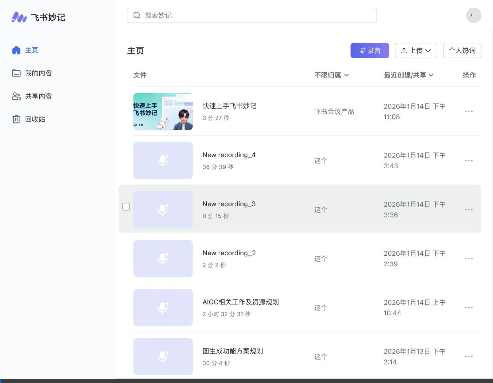

# Meeting Transcription

> Browser-based real-time speech transcription app inspired by Feishu Minutes

A lightweight, privacy-focused meeting transcription tool that runs entirely in your browser with optional local AI processing.

## ✨ Features

- 🎤 **Browser Recording** - Record directly from your microphone
- 📝 **Real-time Transcription** - Speech-to-text with Web Speech API
- 🔤 **Custom Hotwords** - Improve accuracy for names, technical terms
- 💾 **Offline Storage** - All data stored locally in IndexedDB
- 🔒 **Privacy First** - No data leaves your device (when using local ASR)

## 📸 Screenshots

### Reference: Feishu Minutes Overview


### Reference: Recording & Hotwords Configuration


## 🛠️ Tech Stack

### Frontend
- **Vanilla JavaScript** - No framework dependencies
- **Web Speech API** - Real-time browser transcription
- **MediaRecorder API** - High-quality audio capture
- **IndexedDB (Dexie.js)** - Local data persistence

### Backend (Optional)
- **Python 3.8+** with faster-whisper
- Local AI transcription with custom vocabulary support

## 🚀 Quick Start

### 1. 启动后端 (Python API)

```bash
cd /Users/cgy/wkgit/meeting

# 首次运行：创建虚拟环境并安装依赖
uv venv --python 3.12
source .venv/bin/activate
uv pip install -r requirements.txt

# 启动后端服务 (端口 8000)
python -m uvicorn backend.server:app --host 0.0.0.0 --port 8000

# 开发模式（自动重载）
python -m uvicorn backend.server:app --reload --port 8000
```

验证后端运行：
```bash
curl http://localhost:8000/health
# 返回: {"status":"ok","service":"meeting-transcription"}
```

### 2. 启动前端 (HTTP 服务)

```bash
# 在另一个终端窗口
cd /Users/cgy/wkgit/meeting
source .venv/bin/activate

# 启动静态文件服务 (端口 5500)
python -m http.server 5500
```

### 3. 访问应用

打开浏览器访问：**http://localhost:5500**

> ⚠️ **注意**: 必须通过 HTTP 服务器访问（不要直接打开 file://），否则 Web Speech API 和 ES Modules 无法正常工作。

### 仅浏览器模式（无后端）

如果只使用 Web Speech API（无需 Whisper），可以用任意 HTTP 服务器：

```bash
# 方式1：Python
python3 -m http.server 5500

# 方式2：Node.js
npx serve -p 5500

# 方式3：VS Code Live Server 插件
```

## 🔤 Hotwords Support

Custom vocabulary improves recognition accuracy for domain-specific terms:

```python
from faster_whisper import WhisperModel

model = WhisperModel("large-v3", device="cuda")

segments, info = model.transcribe(
    "meeting.mp3",
    language="zh",
    word_timestamps=True,
    # Custom hotwords for better accuracy
    hotwords="Kubernetes Docker 张三 李四 微服务",
    initial_prompt="Technical meeting about container orchestration."
)
```

### Supported Hotword Categories

| Category | Chinese | Example |
|----------|---------|---------|
| Person | 人名 | 张三, John |
| Company | 公司 | Google, 字节跳动 |
| Technology | 技术 | Kubernetes, Docker |
| Location | 地名 | Beijing, 硅谷 |
| Occupation | 职业 | Engineer, 产品经理 |

## 🔧 ASR Options Comparison

| Engine | Hotwords | Offline | Accuracy | Setup |
|--------|----------|---------|----------|-------|
| **Web Speech API** | ❌ | ❌ | Good | None |
| **faster-whisper** | ✅ | ✅ | Excellent | Python |
| **Vosk** | ✅ | ✅ | Good | Python |

## 📁 Project Structure

```
meeting/
├── index.html          # Main entry
├── index.css           # Design system
├── main.js             # App logic
├── services/
│   ├── SpeechRecognition.js
│   ├── AudioRecorder.js
│   └── Database.js
├── docs/
│   ├── images/
│   ├── feishu_minutes_analysis.md
│   └── recording_hotwords_implementation.md
└── README.md
```

## 📖 Documentation

- [Feishu Minutes Analysis](docs/feishu_minutes_analysis.md) - Feature breakdown
- [Recording & Hotwords Guide](docs/recording_hotwords_implementation.md) - Implementation details

## 🌐 Browser Support

| Feature | Chrome | Edge | Firefox | Safari |
|---------|--------|------|---------|--------|
| Web Speech API | ✅ | ✅ | ❌ | ❌ |
| MediaRecorder | ✅ | ✅ | ✅ | ✅ |
| IndexedDB | ✅ | ✅ | ✅ | ✅ |

## 📄 License

MIT
